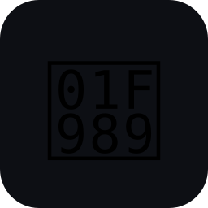

<p align="center">
  
</p>

<h1 align="center">🦉 Hedwig</h1>

<p align="center">
  <strong>내가 소유하고 자연어로 조각하는, 자기진화 개인 SNS 플랫폼</strong><br>
  <em>Personal SNS Platform whose recommendation algorithm you own and evolve in natural language.</em>
</p>

<p align="center">
  
  
  
  
  
  
</p>

<p align="center">
  기업 알고리즘 ↔ <strong>Hedwig (내가 소유한 자기진화 추천 엔진)</strong><br>
  크로스플랫폼 신호를 ⚡ critical / 🌅 daily / 📈 weekly / 💬 on-demand / 📱 feed 다섯 시간축으로 소비
</p>

---

## 📑 Index

<table>
<tr>
<td width="50%" valign="top">

### 🚀 시작하기
- [⚡ 3분 안에 시작](#-3분-안에-시작)
- [💬 Chat — 단일 entry](#-chat--단일-entry-point)
- [🔁 일상 루틴](#-일상-루틴)
- [⚙️ Configuration](#️-configuration)
- [🔧 CLI 레퍼런스](#-cli-레퍼런스)

### 🎛️ 페이지 가이드
- [🗺️ 주요 페이지 11개](#️-주요-페이지)
- [📰 5개 시간축 소비 모드](#-5개-시간축-소비-모드)

</td>
<td width="50%" valign="top">

### 🏛️ 컨셉 / 아키텍처
- [🎯 9가지 핵심 원칙](#️-9가지-핵심-원칙)
- [🧠 Hybrid Ensemble + Meta-Evolution](#-추천-알고리즘--hybrid-ensemble--meta-evolution)
- [📡 20개 소스](#-20개-소스-병렬-수집)
- [🆚 뉴스레터 vs Hedwig](#-뉴스레터-vs-hedwig)

### 📦 개발 / 운영
- [🗃️ 사용자 자산 (export 가능)](#️-사용자-자산-모두-export-가능)
- [🧪 테스트](#-테스트)
- [📚 더 읽기](#-더-읽기)
- [🙏 영감](#-영감을-받은-것들)

</td>
</tr>
</table>

---

## ⚡ 3분 안에 시작

```bash
git clone https://github.com/minsing-jin/hedwig.git
cd hedwig
uv venv .venv && source .venv/bin/activate
uv pip install -e .

python -m hedwig --quickstart
```

> 🔑 OpenAI API 키 **하나만** 있으면 됨. Supabase · Slack · Discord 모두 옵션.
> 🌐 브라우저가 `http://127.0.0.1:8765/chat` 으로 자동 열림.

---

## 🏛️ 9가지 핵심 원칙

| # | 원칙 | 의미 |
|---|---|---|
| 1️⃣ | **Algorithm Sovereignty** | `criteria.yaml` + `algorithm.yaml` + `sovereignty.yaml` + `feeds.yaml` 모두 사용자 소유. 감사·이식 가능 |
| 2️⃣ | **Self-Evolving Fitness** | daily micro · weekly macro · **monthly meta** 3층 진화. Karpathy autoresearch 패턴을 알고리즘 구조에 적용 |
| 3️⃣ | **Quad-Input Sculpting** | explicit (NL 편집) + semi (Q&A 수용) + implicit-active (👍/👎) + implicit-passive (dwell/skip/share) |
| 4️⃣ | **5-Tier Temporal Lattice** | ⚡ critical · 🌅 daily · 📈 weekly · 💬 on-demand · 📱 feed 동시 서빙 |
| 5️⃣ | **Absorption Gradient** | L1 API → L2 OSS 코드 체화 → L3 패턴 추출. 신규 Novelty는 최후 |
| 6️⃣ | **Web = Engine 계기판** | dogfooding + sandbox. 상업 껍데기 금지 |
| 7️⃣ | **Cognitive Augmentation** | 주의 · 편향 · 작업기억 · 메타인지 4한계 매핑 |
| 8️⃣ | **Hybrid Ensemble** | 기본 prior + 로컬 LTR에서 시작해, 충분한 feedback/dependency/model이 있을 때 LightGBM·bandit·sequential 등 선택적 SOTA backend로 확장. 가중치·feature 자체가 진화 대상 |
| 9️⃣ | **Personal SNS Platform** | 소비 UX 자체가 알고리즘 표면 + 행동신호 입력. 브리프=pull, Feed=push |

📖 전체 비전: [`docs/VISION_v3.md`](docs/VISION_v3.md)

---

## 💬 Chat — 단일 entry point

`/chat` 한 화면에서 LLM이 11개 도구로 자동 라우팅:

| 사용자 발화 | 호출되는 도구 |
|---|---|
| 📰 "오늘 daily 브리핑 보여줘" | `get_brief` |
| 🔍 "agent framework 5개 뽑아줘" | `search_signals` |
| 🎬 "이 URL 요약: youtu.be/..." | `summarize_url` (yt-dlp 자막 추출) |
| 📝 "agent 위주로 바꾸고 crypto 빼" | `propose_criteria` → diff → apply |
| 🎛️ "bandit 비중 0.3으로" | `propose_algorithm` → diff → apply |
| ▶️ "daily 실행해줘" | `trigger_pipeline` |
| 🧬 "이번 주 진화 요약" | `get_evolution_timeline` |
| 🌐 "최근 RecSys oral 논문" | `live_search` (exa.ai) |

> 💡 ChatGPT 스타일 사이드바 + 대화 영속 + 마크다운/코드블록 렌더링.

---

## 📰 5개 시간축 소비 모드

| 층위 | 트리거 | 형태 | 위치 |
|---|---|---|---|
| ⚡ **Critical** | 즉시 (15-30분 polling) | push | `python -m hedwig --critical-loop` |
| 🌅 **Daily** | 매일 아침 | LLM brief | `/brief` + Slack/Discord/Email |
| 📈 **Weekly** | 주 1회 | 전략 brief + 기회 포착 | `/brief?cycle=weekly` |
| 💬 **On-Demand** | 사용자 질문 | RAG + live search | `/chat` |
| 📱 **Feed** | 사용자가 열 때 | SNS 무한스크롤 | `/feed` (4 deck: 메인 / 딥다이브 / 주말 / Critical만) |

---

## 🧠 추천 알고리즘 — Hybrid Ensemble + Meta-Evolution

### 🅰️ Stage A — Retrieval (저렴)
- 🧮 `pre_scorer` 5-factor (engagement · authority · recency · convergence · text-match)
- 📊 last30days-style enrichment (persistence + saturation + velocity)

### 🅱️ Stage B — Ranking Ensemble (`algorithm.yaml`로 사용자 제어)
| 컴포넌트 | 역할 |
|---|---|
| 🧠 **llm_judge** | top_k 만 (deep qualitative + Devil's Advocate) |
| 🌳 **ltr** | 기본 prior → pure-Python logistic SGD → LightGBM LambdaMART 순으로 승급. LightGBM은 dependency + 학습된 모델 파일이 있을 때만 active |
| 🔡 **content_based** | OpenAI embedding cosine / Jaccard fallback |
| 📈 **popularity_prior** | authority × recency |
| 🎰 **bandit** | Thompson sampling per platform |
| 🧵 **sequential** | SASRec-inspired Jaccard over recent dwell sequence |
| ⚖️ **IPS debias** | opt-in propensity correction |

### 🧬 Evolution 3층
- 🌅 **Daily** — criteria weight 미세조정
- 📈 **Weekly** — interpretation_style 진화 + user_memory 스냅샷 + multi-task fitness + REINFORCE-lite (LTR weights)
- 🔬 **Monthly Meta** — `algorithm.yaml` 자체 mutate → shadow test → adopt
  - 4 strategies: weight_perturb / feature_toggle / structural / **feature_suggest_from_papers**

> 🔍 모든 변화는 [`/evolution`](http://127.0.0.1:8765/evolution) 타임라인에 audit 가능.
> 🧠 실제 backend 상태는 [`/status`](http://127.0.0.1:8765/status)의 **Owned Algorithm Training Status**에서 확인 가능.

---

## 📡 20개 소스 (병렬 수집)

| 카테고리 | 소스 |
|---|---|
| 🏢 **Frontier labs** | `ai_labs` — OpenAI · Anthropic · Google AI/Research · DeepMind · Hugging Face · Meta · Microsoft + TechCrunch · Verge · VentureBeat · Wired |
| 📚 **Academic** | `arxiv` (cs.AI/CL/LG/CV/MA/stat.ML) · `arxiv_recsys` (자기참조) · `semantic_scholar` · `papers_with_code` (HF Daily Papers) |
| 💻 **Tech** | `hackernews` · `github_trending` · `geeknews` · `youtube` |
| 👥 **Social** | `twitter` · `reddit` · `linkedin` · `threads` · `bluesky` (handle RSS) · `tiktok` 🔒 · `instagram` 🔒 |
| 📨 **Newsletters** | Latent Space · Bensbites · The Decoder · AINews · ImportAI · TheAIEdge · Superhuman AI · The Gradient |
| 📊 **Markets** | `polymarket` |
| 🎙 **Multimedia** | `youtube` 자막 + `podcast` (RSS + optional Whisper) 🔒 |
| 🌐 **Web search** | `exa.ai` (on-demand) 🔒 |

> 🔒 = env 키 필요 (`/setup` 에서 설정)
> ⚙️ `asyncio.gather` 로 동시 fetch — 가장 느린 소스만큼만 기다림 (~20-30초)
> 🩺 `/status` 페이지에서 소스별 health + 빠진 env 키까지 한눈에

---

## 🗺️ 주요 페이지

| 경로 | 용도 |
|---|---|
| 💬 `/chat` | 모든 기능을 자연어로. ChatGPT 스타일 |
| 📱 `/feed` | 무한스크롤 + j/k/u/d/s 키보드 + swipe + dwell beacon |
| 📰 `/brief` | daily/weekly LLM 브리핑. GeekNews 스타일 헤드라인+토글 |
| 👤 `/profile` | criteria + algorithm + style + 7일 personality + export |
| 🧬 `/evolution` | criteria/algorithm 변경 + Q&A + 진화 사이클 통합 timeline |
| 🧪 `/sandbox` | "bandit 비중 바꾸면?" what-if 시뮬레이션 |
| 🔬 `/meta` | Meta-Evolution 한 사이클 + 자연어 algorithm.yaml 편집 |
| 📊 `/status` | exit_conditions 4 게이트 + 20개 소스 health |
| 🏛️ `/sovereignty` | user_editable / system_mutable / readonly_history 경계 |
| 🔧 `/admin` | 데이터 초기화 (signals / evolution / chat / all 스코프) |
| 🎯 `/demo` | 개념 투어 + seed 가짜 데이터로 즉시 체험 |

---

## 🔁 일상 루틴

### 📅 매일 (5분)
1. 💬 `/chat` 또는 홈에서 `▶ Run Daily Pipeline` 클릭
2. 📱 `/feed` 에서 `j`/`k` 로 스크롤하며 👍/👎 (dwell 자동 수집)
3. 🗣️ 자연어로 방향 조정: `/chat` 에 *"agent 위주로"*

### 🗓️ 매주
```bash
python -m hedwig --weekly
```
- 📈 weekly brief 생성 (`/brief?cycle=weekly`)
- 🎙 interpretation_style 진화
- 🧠 user_memory 스냅샷
- 🎯 multi-task fitness 계산
- 🔁 REINFORCE-lite LTR weight 업데이트

### ⏱ 자동화 (cron)
```bash
0 9 * * *  cd ~/Desktop/hedwig && .venv/bin/python -m hedwig
0 10 * * 1 cd ~/Desktop/hedwig && .venv/bin/python -m hedwig --weekly
@reboot    cd ~/Desktop/hedwig && .venv/bin/python -m hedwig --critical-loop
```

---

## 🗃️ 사용자 자산 (모두 export 가능)

```
📝 criteria.yaml          # 무엇을 추천할지 (관심사 · care_about · ignore)
⚙️ algorithm.yaml         # 어떻게 추천할지 (component weight · feature · 구조)
📚 feeds.yaml             # 다중 피드 (메인 / 아침 딥다이브 / 주말 탐색 / Critical만)
🏛️ sovereignty.yaml       # 누가 어떤 path 쓸 수 있나
🧬 evolution_log.jsonl    # daily/weekly 사이클 audit
🔬 algorithm_log.jsonl    # meta-evolution 채택/기각 audit
🧠 user_memory.jsonl      # 주간 사용자 메모리 스냅샷
🗄️ ~/.hedwig/hedwig.db    # SQLite (signals + feedback + behavior + judgments + …)
```

📦 `POST /algorithm/export` → 위 4 yaml + 활성 interpretation style을 zip 번들로 다운로드
📥 `POST /algorithm/import` → 다른 사람의 알고리즘 import (sovereignty 검사 + dry-run preview 후)

---

## 🔧 CLI 레퍼런스

```bash
🚀 python -m hedwig --quickstart           # zero-config local mode
📅 python -m hedwig                        # daily 풀 파이프라인
🗓️ python -m hedwig --weekly               # weekly brief + macro + RLHF
⚡ python -m hedwig --critical-loop        # critical 폴링 데몬 (20분 간격)
⏱  python -m hedwig --critical-interval 600 # 간격 조정
🔬 python -m hedwig --meta-cycle           # meta-evolution 1회
🧪 python -m hedwig --dry-run              # 수집만 (LLM 비용 0)
🧹 python -m hedwig --reset [scope]        # 데이터 초기화 (all/signals/evolution/chat)
🌐 python -m hedwig --dashboard            # 웹만 따로 기동
📡 python -m hedwig --sources              # 등록된 20개 소스 출력
💬 python -m hedwig --onboard              # CLI Socratic 인터뷰
```

---

## ⚙️ Configuration

### 🔑 필수
```bash
OPENAI_API_KEY=sk-...
```

### 🎛️ 선택 (UI [`/setup`](http://127.0.0.1:8765/setup) 에서 설정)
```bash
# 정규화 / 검색 / 소스
JINA_API_KEY=...                   # 100× rate limit on URL→Markdown
EXA_API_KEY=...                    # live_search 도구
SCRAPECREATORS_API_KEY=...         # TikTok + Instagram 활성
HEDWIG_PODCAST_FEEDS=url1|name1,url2|name2
HEDWIG_PODCAST_TRANSCRIBE=1        # OpenAI Whisper로 자동 자막
HEDWIG_BSKY_HANDLES=alice.bsky.social,bob.bsky.social

# 파이프라인 모드
HEDWIG_PIPELINE=ensemble           # default. 'single'로 legacy LLM-only

# Delivery (모두 옵션)
SLACK_WEBHOOK_ALERTS=...   SLACK_WEBHOOK_DAILY=...
DISCORD_WEBHOOK_ALERTS=... DISCORD_WEBHOOK_DAILY=...
SMTP_HOST=... SMTP_USER=... SMTP_PASS=... SMTP_FROM=...

# Storage (자동 감지 — 둘 다 비우면 SQLite local)
SUPABASE_URL=...    SUPABASE_KEY=...
HEDWIG_STORAGE=sqlite|supabase
```

---

## 🧪 테스트

```bash
.venv/bin/python -m pytest tests/
# 562 passed ✅
```

---

## 🆚 뉴스레터 vs Hedwig

| 축 | 📨 뉴스레터 | 🦉 Hedwig |
|---|---|---|
| 누구를 위한 큐레이션 | 만 명 → 같은 1개 | **나만의** 1개 |
| 취향 학습 | ❄️ 정적 | 🔁 **자기 진화 (daily/weekly/monthly)** |
| 소스 통합 | 1-3개 분야 | 🌐 **20개 플랫폼** 한 번에 |
| 반대 관점 | 편집자 1명 | 😈 **Devil's Advocate 자동** |
| 알고리즘 소유권 | 발행자 자산 | 🏛️ **algorithm.yaml = 내 자산. export 가능** |

> 💡 **뉴스레터는 "남이 만든 메뉴", Hedwig는 "내가 매일 깎는 부엌".**

---

## 📚 더 읽기

| 문서 | 무엇이 있나 |
|---|---|
| [`docs/VISION_v3.md`](docs/VISION_v3.md) | 9원칙 / 6 차별축 / 전체 아키텍처 |
| [`docs/HYBRID_ENSEMBLE.md`](docs/HYBRID_ENSEMBLE.md) | 추천 알고리즘 한 페이지 — 2-stage + 6 component + 자기진화 |
| [`docs/phase_reports/principle_alignment.md`](docs/phase_reports/principle_alignment.md) | 원칙 ↔ 코드 매핑 |
| [`docs/phase_reports/sns_platform_gap.md`](docs/phase_reports/sns_platform_gap.md) | Personal SNS Platform 전환 분석 |
| [`docs/phase8_prd.md`](docs/phase8_prd.md) | SOTA 추천 모델 도입 PRD |
| [`docs/absorption_backlog.md`](docs/absorption_backlog.md) | 흡수 대기 OSS + 논문 |
| [`docs/LIBRARY_EXTRACTION.md`](docs/LIBRARY_EXTRACTION.md) | `hedwig-engine` 분리 계획 |
| [`seed.yaml`](seed.yaml) | Ouroboros Socratic 인터뷰 결과물 (ambiguity 0.12) |

---

## 🙏 영감을 받은 것들

| Project | 빌려온 것 |
|---|---|
| 🧠 [karpathy/autoresearch](https://github.com/karpathy/autoresearch) | Self-improvement 루프 패턴 |
| 📖 [jina-ai/reader](https://github.com/jina-ai/reader) | URL→Markdown 정규화 |
| 📊 [mvanhorn/last30days-skill](https://github.com/mvanhorn/last30days-skill) | Multi-signal 스코어링 (L2 흡수) |
| 🏛️ Ouroboros Socratic Interview | criteria 명료화 (ambiguity ≤ 0.2) |
| 🐦 Twitter the-algorithm · YouTube ranker · MMOE | 2-stage retrieval + ranking 구조 |
| 📑 SIGIR / RecSys / NeurIPS oral papers | feature_suggest_from_papers 메타 진화 연료 |

---

## 📜 License

MIT

---

<p align="center">
  <em>The algorithm that decides what information reaches you should belong to you.</em><br>
  <strong>당신에게 닿는 정보를 정하는 알고리즘은 당신 것이어야 합니다.</strong>
</p>

<p align="center">
  <a href="#-index">⬆ 맨 위로</a>
</p>
